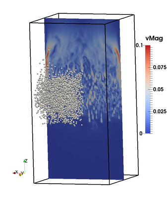
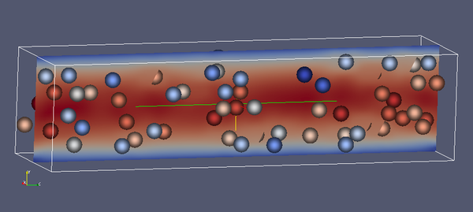

# LBDEMcoupling

* [About](#about)
* [Compatibility](#compatibility)
* [Installation](#installation)
* [Setting Up a Simulation](#setting_up)
* [Implicit Assumptions, Known Issues](#assumptions)
* [Gallery](#gallery)
* [Documented Compiler Switches](#compilerswitches)
* [Citing LBDEMcoupling](#citing)
* [References](#references)
* [License and Copyright](#license)

<a name="about"></a>
## About

LBDEMcoupling is a coupling between the Lattice Boltzmann (LB) library
Palabos (http://www.palabos.org) and the Discrete Element Method code
LIGGGHTS® (http://www.ligggghts.com). It implements the model of Noble
and Torczinsky [[1]](#ref1) for resolved coupling between particles
and a fluid phase.

<a name="compatibility"></a>
## Compatibility

Currently, LBDEMcoupling is compatible with the following versions:
* LIGGGHTS 3.1
* Palabos v1.5r1

We are working on establishing compatibility with the latest version of LIGGGHTS. To ensure maximum compatibility, we have created a Palabos repository to be found [here](https://github.com/ParticulateFlow/Palabos-PFM). This repo contains the most recent vanilla Palabos release as well as a few minor bug fixes and some add-ons developed by PFM. It is recommended to use this version of Palabos with LBDEMcoupling.

<a name="installation"></a>
## Installation

Just clone the git repo, and create the following three shell
variables in your .bashrc:

          export PALABOS_ROOT=path/to/palabos/
          export LIGGGHTS_ROOT=path/to/liggghts/
          export LBDEM_ROOT=path/to/lbdem/

You also need to move the files

         fix_lb_coupling_onetoone.cpp
         fix_lb_coupling_onetoone.h

to your LIGGGHTS installation directory and recompile LIGGGHTS from
scratch with

         make clean-all; make fedora

where `fedora` should be replaced with your makefile name as given in the LIGGGHTS manual.

<a name="setting_up"></a>
## Setting Up a Simulation

It is assumed that you have basic knowledge in both Palabos and
LIGGGHTS. If you are not familiar with one or both of the codes, it is
strongly recommended that you work through a few tutorial and example
cases.

To compile a case, it is necessary to build LIGGGHTS as a
library. This is explained in the LIGGGHTS documentation. Both shared and static libraries of LIGGGHTS can be used with LBDEMcoupling, although the latter is considered deprecated. Newly added example cases will most likely use shared libraries.

### Makefile settings
LBDEMcoupling uses the Palabos build system (Makefile frontend with SCons backend). A few settings are required to ensure case compilation will find all the required resources. Here is an example makefile:

```make
##########################################################################
## Makefile for the LBDEMcoupling example program benchmark
##
## The present Makefile is a pure configuration file, in which
## you can select compilation options. Compilation dependencies
## are managed automatically through the Python library SConstruct.
##
## If you don't have Python, or if compilation doesn't work for other
## reasons, consult the Palabos user's guide for instructions on manual
## compilation.
##########################################################################

# USE: multiple arguments are separated by spaces.
#   For example: projectFiles = file1.cpp file2.cpp
#                optimFlags   = -O -finline-functions

# Leading directory of the Palabos source code
palabosRoot  = ${PALABOS_ROOT}
# Name of source files in current directory to compile and link with Palabos
projectFiles = benchmark.cpp \
          ${LBDEM_ROOT}/src/liggghtsCouplingWrapper.cpp \ 
          ${LBDEM_ROOT}/src/latticeDecomposition.cpp

# Set optimization flags on/off
optimize     = true
# Set debug mode and debug flags on/off
debug        = false
# Set profiling flags on/off
profile      = false
# Set MPI-parallel mode on/off (parallelism in cluster-like environment)
MPIparallel  = true
# Set SMP-parallel mode on/off (shared-memory parallelism)
SMPparallel  = false
# Decide whether to include calls to the POSIX API. On non-POSIX systems,
#   including Windows, this flag must be false, unless a POSIX environment is
#   emulated (such as with Cygwin).
usePOSIX     = true
# Path to external libraries (other than Palabos)
libraryPaths = ${LIGGGHTS_ROOT}/src/
# Path to inlude directories (other than Palabos)
includePaths = ${LBDEM_ROOT}/src/ ${LIGGGHTS_ROOT}/src
# Dynamic and static libraries (other than Palabos)
libraries = liblammps.so

# Compiler to use without MPI parallelism
serialCXX    = g++
# Compiler to use with MPI parallelism
parallelCXX  = mpicxx
# General compiler flags (e.g. -Wall to turn on all warnings on g++)
compileFlags = -Wnon-virtual-dtor -Wno-write-strings
# General linker flags (don't put library includes into this flag)
# replace -llmp_fedora with the name of your library!
linkFlags    = 
# Compiler flags to use when optimization mode is on
optimFlags   = -O3
# Compiler flags to use when debug mode is on
debugFlags   = -g
# Compiler flags to use when profile mode is on
profileFlags = -pg
```

The paths are set through the shell variables `${PALABOS_ROOT}`, `${LIGGGHTS_ROOT}`, and `${LBDEM_ROOT}`. The two addidional source files are part of LBDEMcoupling, and need to be given explicitly. Future versions might detect this dependency automatically. `${LIGGGHTS_ROOT}` and `${LBDEM_ROOT}` are given as include paths because headers from these directories are needed. The other settings are more or less self-explanatory, and are explained in more detail in the Palabos documentation.

#### Static Libraries
If, for some reason, you are restricted to a static LIGGGHTS library, linking can still be done. Due to some LIGGGHTS internals, the makefile needs to be adjusted: The section 

          libraries = liblammps.so
          
needs to be replaced with

          libraries =
          
and the static library is linked to the case with

          linkFlags    = -Wl,--whole-archive -llmp_fedora -Wl,--no-whole-archive

Of course, replace `-llmp_fedora` and the like with your library name.

### Coupling API

As for now, the coupling API is rather limited, and several tasks are coded explicitly in each case. This might change in the future. For now, the most important API elements are

* the header file `plb_ib.h`: an aggregate header that provides all functionality implemented in LBDEMcoupling
* `class PhysUnits3D`: a conversion utility to convert between Palabos simulation units and physical units. See [this excellent document by Jonas Latt](http://wiki.palabos.org/_media/howtos:lbunits.pdf) for how unit conversion is performed, and the file `${LBDEM_ROOT}/src/physunits.h` for the detailed interface.
* `class LIGGGHTScouplingWrapper`: a wrapper for an instance of LIGGGHTS. Important methods
  * `LIGGGHTScouplingWrapper(char **argv, MPI_COMM communicator)`: The constructor needs the arguments array, and a valid MPI communicator. The latter is usually supplied via the Palabos call `global::mpi().getGlobalCommunicator()`. Currently, no command line argument passing from Palabos to LIGGGHTS is implemented.
  * `void execFile(char* const fname)` executes the commands given in a file
  * `void execCommand(char* const command)` executes a single LIGGGHTS command. There is also a version of this function accepting a `std::stringstream` for convenience.
  * `void run(plint nStep)` and `void runUpto(plint nStep)`: equivalent to the LIGGGHTS commands `run` and `run upto`
  * `int getNumParticles()` returns the total number of particles in the domain
  * `void setVariable(char const *name, double value)` and `void setVariable(char const *name, std::string &value)` define a LIGGGHTS variable just like the `variable` command. The latter creates a `variable string` (see LIGGGHTS docu).
* wrapper functions for the actual coupling
  * `void setSpheresOnLattice(MultiBlockLattice3D &lattice,LIGGGHTScouplingWrapper &wrapper,PhysUnits3D &units, bool initWithVel)` writes particle information to the lattice. If `initWithVel` is `true`, the velocity at all cells covered by a particle is set to the particle velocity. This can be useful for initialization purposes.
  * `void getForcesFromLattice(MultiBlockLattice3D &lattice,LIGGGHTScouplingWrapper &wrapper,PhysUnits3D &units)` collects the hydrodynamic forces on the particles.


<a name="gallery"></a>
## Gallery

### Settling spheres



### Square Channel with Particles




<a name="assumptions"></a>
## Implicit Assumptions, Known Issues

### Sphere size

The code implicitly assumes that all your particles are larger than
four grid spacings and smaller than half the smallest extent of any
partition.

### Multiple Definition Errors

If you come across a multiple definition error during compilation,
please consult  
in the Palabos forum (copy the URL if the link does not work).

<a name="compilerswitches"></a>
## Documented Compiler Switches

LBDEM_USE_MULTISPHERE switches on support for the (non-public)
multisphere model of LIGGGHTS

<a name="citing"></a>
## Citing LBDEMcoupling

If you found LBDEMcoupling useful (which we hope you do), you might want to cite it. If so, please cite the following conference paper:

Seil, P., & Pirker, S. (2017). LBDEMcoupling: Open-Source Power for Fluid-Particle Systems. In *Proceedings of the 7th International Conference on Discrete Element Methods* (pp. 679-686). Springer Singapore.

<a name="references"></a>
## References

<a name="ref1">[1]</a> Noble, D. R., & Torczynski, J. R. (1998). A
lattice-Boltzmann method for partially saturated computational
cells. *International Journal of Modern Physics C*, 9(08), 1189-1201.

<a name="license"></a>
## License and Copyright

(c) Johannes Kepler University Linz, Austria

released under the GPLv3

main author: Philippe Seil (philippe.seil@jku.at)

LIGGGHTS® is a registered trade mark of DCS Computing GmbH, the
producer of the LIGGGHTS® software.

Palabos is a registered trademark of FlowKit Ltd., the developer of the Palabos software.
