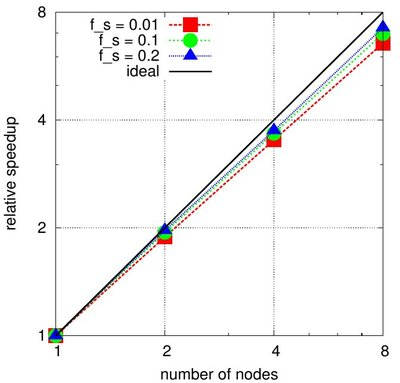
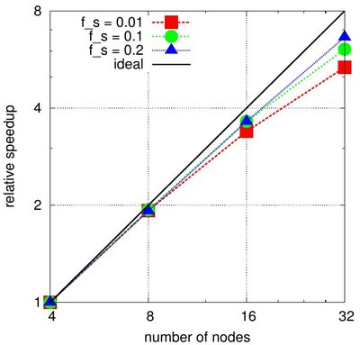

# Benchmark case

This case can be used to benchmark LBDEMcoupling on your machine. It
simulates spheres settling in a tank of fluid under gravity, as shown
in the image below.  


## Running the case

The case consists of a tank of 1x1x2m filled with fluid. Several
command line parameters can be used to control some details, the
syntax is

```
./benchmark d_part N fs nu_f v_inf uMax outDir
```

where
* d_part is the particle diameter
* N is the number of grid points per particle diameter
* fs is the solid fraction in the insertion region
* nu_f is the fluid viscosity
* v_inf is an estimated settling velocity
* uMax is the maximum velocity in LB units, proportional to the Mach
number
* outDir is the directory where your output shall be stored. It must
contain the subdirectories outDir/post and outDir/tmp.

Note that the tank size is fixed - thus the total resolution is
controlled by N and d_part!


A few working parameter sets are:
```
./benchmark 0.1 5 0.1 1e-4 0.15 0.02 your/out/dir
```

results in ~70 particles on a 51x51x101 grid. Feasible on a desktop
computer.  Particle Reynolds number ~150

```
./benchmark 0.06 5 0.1 1e-4 0.10 0.02 your/out/dir
```

~340 particles on a 84x84x164 grid - might need 1-2h or so on a
desktop computer.  Particle Reynolds number ~90

```
./benchmark 0.02 5 0.1 1e-5 0.15 0.02 your/out/dir 
```

gives you ~10k particles on a 251x251x501 grid - computationally demanding!
Particle Reynolds number ~300

## Our results

To check the scalability, we used the last example setting in the
previous section. We varied solid fraction and resolution. Here are
some results we obtained on an Intel cluster with eight cores per
processor node for different resolutions: 5, 8, and 10 grid nodes per
sphere.

### N=5


### N=8



### N=10

