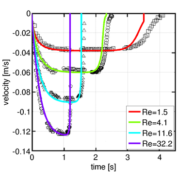

# Sedimenting Sphere

This case computes a single sphere settling under gravity in a tank of
fluid. This is a benchmark case originally published by Ten Cate et
al. [[1]](#ref1). The authors conducted experiments and used these to
test lubrication force models for the wall-sphere contact. In the
present case, no lubrication modelling has been performed, thus the
velocity towards the end of settling deviates from the
experiments. The terminal velocity, however, is correctly reproduced
by the simulations.

## Running the case

The command line for the case is

```
./sedimentingSphere N uMax rho_f mu_f v_inf maxT outDir
```

with the parameters
* N being the resolution - the number of grid points along the sphere
* uMax being the maximum LB velocity
* rho_f the fluid density in SI units
* mu_f the *dynamic* viscosity in SI units
* v_inf is an estimate for the settling velocity in SI units
* maxT is the run time in seconds
* outDir is the directory for the output. It must contain
subdirectories outDir/post and outDir/tmp for LIGGGHTS and Palabos
outputs respectively.

The case writes position, velocity and force on the particle to stderr
each timestep. To write this data to a file for post-processing,
simply pipe stderr to a file with a command such as


``` 
./sedimentingSphere your-parameters 2> your-datafile.txt 
```

The parameters for the four experiments are given in the table
below. A more thorough description of the geometry and details on the
experiments and simulations can be found in reference [[1]](#ref1).

| Experiment | fluid density (kg/m^3) | fluid viscosity (Pa s) | experimental sedimentation velocity (m/s) |
| -------- | --------- | -------- | ---------- |
| E1 | 970 | 0.373 | 0.038 |
| E2 | 965 | 0.212 | 0.6   |
| E3 | 962 | 0.113 | 0.091 |
| E4 | 960 | 0.058 | 0.128 |


## Results

The image below shows a comparison between the results of [[1]](#ref1)
(symbols) and our simulations (lines). The resolution was N=8, and
uMax was set to 0.02. The terminal velocity is found correctly, the
deviations at the end of settling are due to missing lubrication
corrections. Computational time is O(10min) on a desktop computer.



## References

<a name="ref1"> Ten Cate, A., Nieuwstad, C. H., Derksen, J. J., & Van
den Akker, H. E. A. (2002). Particle imaging velocimetry experiments
and lattice-Boltzmann simulations on a single sphere settling under
gravity. *Physics of Fluids* (1994-present), 14(11), 4012-4025.